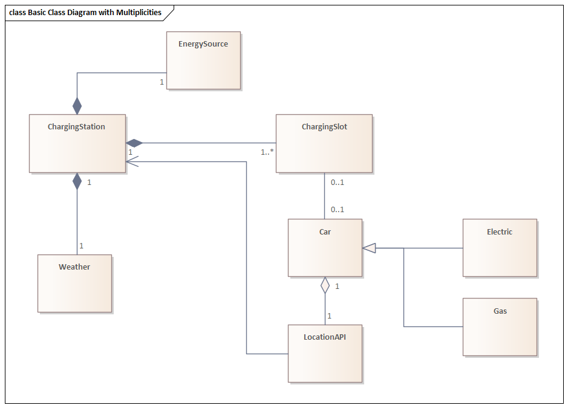

# Java Project

## Authors
- Hazhir Amiri.
    - Matriculation Number: 7218509.

- Leander Hackmann.
    - Matriculation Number: 7217912

- Luis Fernando Rodriguez Gutierrez.
    - Matriculation Number: 7219085

- Mohammed Al Salihi.
    - Matriculation Number: 7218958.

## Capstone Video
A capture of the execution of the project can be found here:

https://youtu.be/upBa6pgkwjk

## Simulation
The simulation begins after the user selects "Begin Simulation" in the main menu and finishes when all cars have either gotten charged or failed to. At the end of every simulation, a summary of all the cars and their charging stats will be shown.

The duration of the simulation depends on the number of stations and cars the user selects. In a simulation with 5 cars and 4 stations, the simulation takes about 1 minute to finish.

The simulation either finishes on its own or can only be stopped by a keyboard interrupt, after which the program finishes its execution. 

## Structure

The system consists of Charging Stations and Cars. Each one is represented by a long-running thread.

### Car
As cars are deployed, they query the Location API, looking for a suitable station to join. If they find one, they'll join the station's queue and wait to get charged. Otherwise, they will leave the simulation since they haven't found a suitable station. Cars waiting in a station's queue will constantly check to see if the station has enough fuel for them and if the waiting time is still suitable for them. This is needed because priority cars may also join and skip the queue, causing longer wait times for normal cars. In this case, the car would leave the station's queue and look for another station. Cars sleep for 1 second between each iteration.

### Charging Station
Stations handle and manage the cars in their queue. At each iteration, they send cars to empty Charging Slots. Stations sleep for 1 second between every iteration. The slots of the stations also run iterate at 1-second intervals, in which they get fuel from the station reserve and charge cars based on the station throughput.

### Weather and Energy Source
Each station has a weather state that constitutes what energy source it uses. There are two energy sources: Solar and Power Grid. In case of sunny weather, the station switches to Solar, which increases its electricity throughput. If the weather is not sunny, the station switches to the Power Grid and its electricity throughput will be its default set at initialization.

## Instructions

### Eclipse
Right-click click on the project on Eclipse, then `Run As -> 1 Java Application`. Select `Main` and click OK. The console should open, displaying the main menu.

### VS Code
Open the project in VS Code, go to the `Main.java` file and run it. The terminal should open, displaying the menu.

## Task Distribution
| Name  	| Hazhir Amiri                                     	| Leander Hackmann                                     	| Luis Fernando Rodriguez Gutierrez                                                        	| Mohammed Al Salihi                     	|
|-------	|--------------------------------------------------	|------------------------------------------------------	|------------------------------------------------------------------------------------------	|----------------------------------------	|
| Tasks 	| Main menu, logging, sequential logic, some overall bug fixing 	| Car classes and their logic, threaded charging logic 	| byte stream logging, reading car and station data from file, weather and energy source logic, location API 	| ChargingStation and ChargingSlot logic, annotation and metadata 	|
